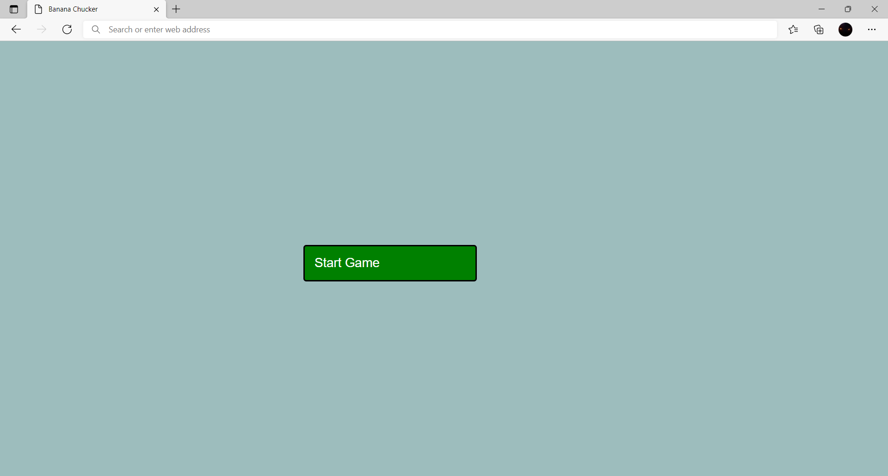
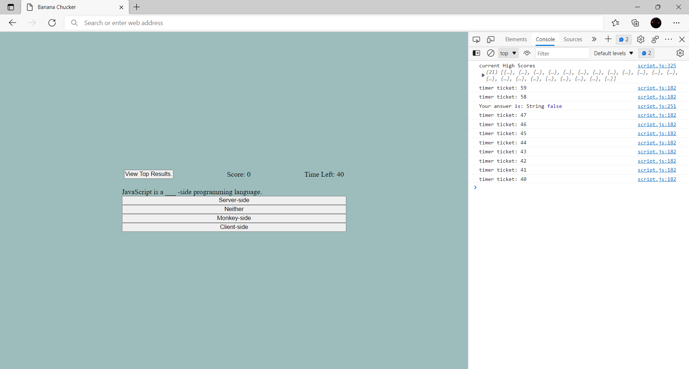

# This is quiz challenge readme
This challenge, required full creation aka no starter code. Required to begin a quiz 
while starting a countdown timer. While also decrementing time with incorrect answers. 
Displaying both correct / incorrect answers. At the end timer needs to stop and 
vice versa. Additionally being able to input highscores

## languages used
HTML, css and primarily javascript

### live web
https://box-monkey.github.io/banana-chucker/

#### screen shots

